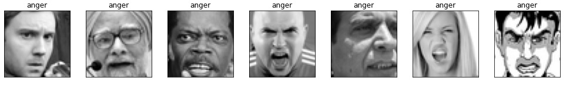
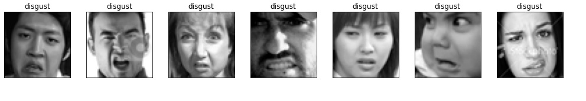
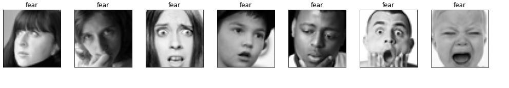
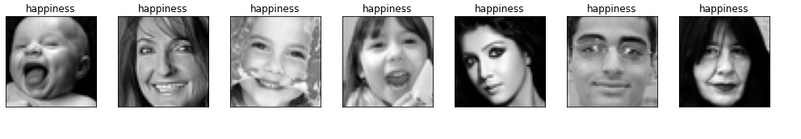
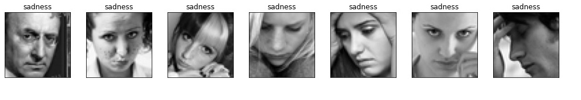
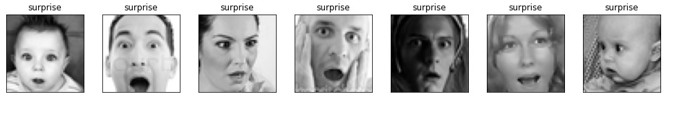
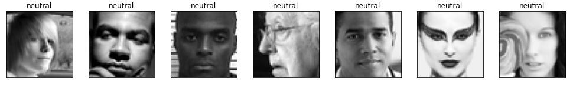

# Face Detection and Emotion Recognition 
- Tech/Fameworks used: OpenCV, Keras/TensorFlow, OpenCV and Deep Learning (look at the requirements.txt file)

## Introduction
Human emotion detection is implemented in many areas requiring additional security or information about the person. Another important domain where we see the importance of emotion detection is for business promotions. Most of the businesses thrive on customer responses to all their products and offers. Also,the use of machines in society has increased widely in the last decades such as robots and in this context, deep learning has the potential to become a key factor to build better interaction between humans and machines, while providing machines with some kind of self-awareness about its human peers, and how to improve its communication with natural intelligence. 

> **Motivation and goals**

This project is a part of Data Science Academy by [Brainster](https://brainster.co/) with the primary goal, students to practically demonstrate the acquired knowledge as a final assignment. Technically, the project’s goal consists on training a deep neural network with labeled images of facial emotions. Finally, this is a multidisciplinary project involving affective computing, machine learning and computer vision. Learning how these different fields are related, and to understand how they can provide solutions to complex problems is another project’s goal. 

## 💡: Materials and Methods
The task in this project is to create a robust Image classifier, that given an image will find all of the faces within the image and then recognize the emotion of the person. The **:seven:emotions** besides neutral class that classifier will need to choose from are:

 
 
  

We can generalize the emotion detection steps as follows:
- *Dataset preprocessing*
- *Face detection*
- *Feature extraction*
- *Classification based on the features*

This project has been divided into three phases: 

> **:one: phase** focused on dataset creation.More details about can be found in Chapter **Data**.

> **:two: phase** focused on training the model and consisted on the use of a facial emotion labeled data set to train a deep learning network. A detailed explanation is presented in Chapter **Models**

> **:three: phase** is focused on testing the model performance, explanation is presented in Chapter **Results**

### 📂: Data
- General Project Research

As it was stated previously, the following project belongs to the supervised learning category. The need for a data set containing images of facial emotions and their corresponding label is crucial. One of the first challenges while doing this project was collecting the data. We decided to collect images using ready-made data and datasets that were created for facial recognition purposes. The reason for this is the topic-specific, recognizing emotions. For this purpose, a couple of data sets were chosen to perform the experiment:

**DA NABROIME KOI DATASET GI KORISTEVME**

- Dataset Collection

This dataset consists of **35887 images** belonging to seven classes:

| Dataset         | Total      |      
| -------------   | -----------| 
| **0 - anger**   | 4953       | 
| **1 - disgust** |  547       | 
| **2 - fear**    | 5121       | 
| **3 - happines**| 8989       | 
| **4 - sadness** | 6077       |
| **5 - surprise**| 4002       | 
| **6 - neutral** | 6198       | 
| **Total**       |35887       |

### Preview of dataset (first 7 images from the 7 target categories)

### 💻: Models

### 🔑: Results

## 👏: Authors

💪:Team members:
* [Petar Urdjanov](https://github.com/PetarUrdjanov)
* [Savica Nedelkovska](https://github.com/Savica23)
* [Marija Ilievska](https://github.com/MarijaIlievska)
* [Martin Krsteski](https://github.com/MartinKrsteski)

👌Team supervisor:
* [Viktor Domazetovski](https://github.com/ViktorDo1)
