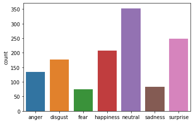
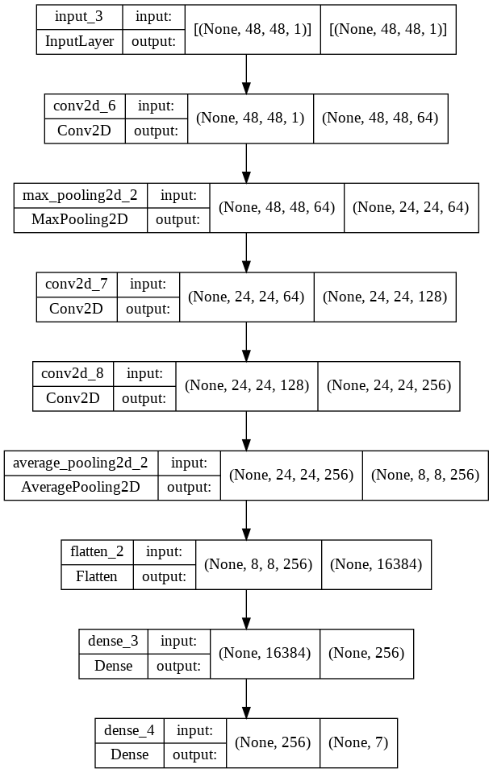
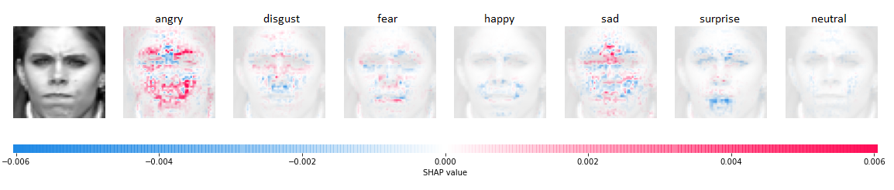
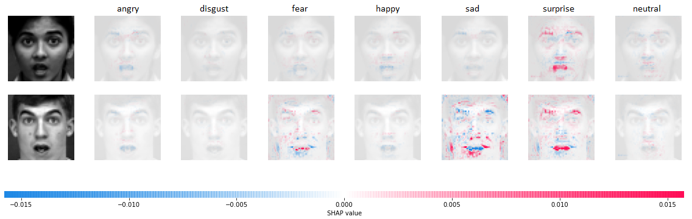
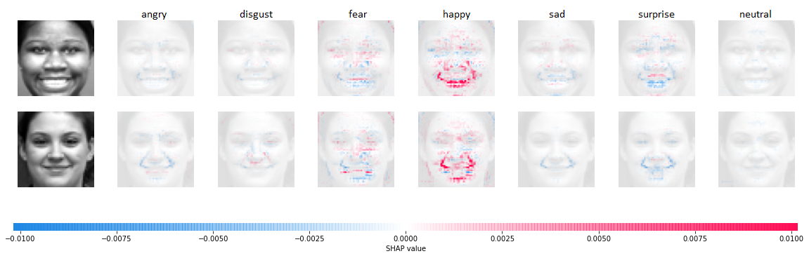
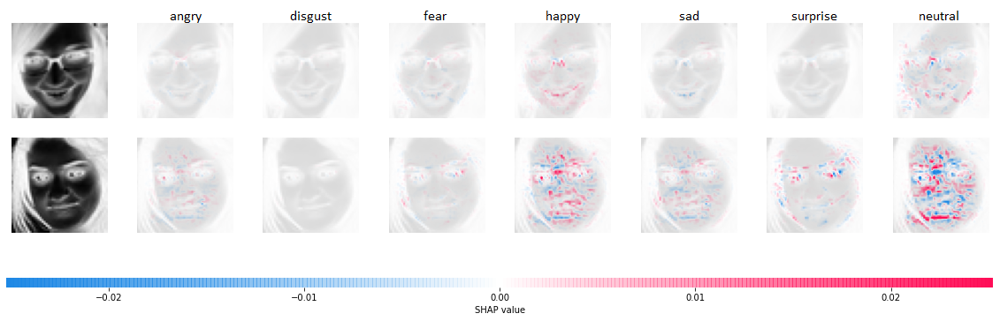
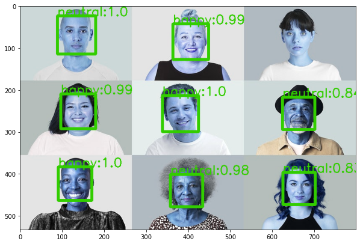
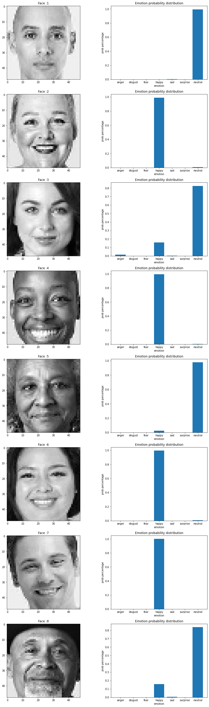
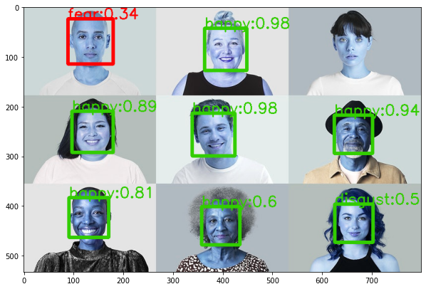
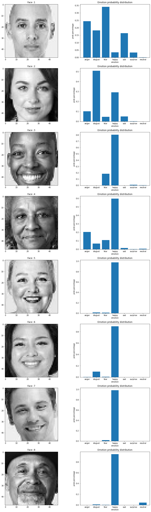

# Face Detection and Emotion Recognition [](https://www.python.org/downloads/release/python-360/)
- Tech/Fameworks used: OpenCV, Keras/TensorFlow, and Deep Learning

## Introduction
Human emotion detection is implemented in many areas requiring additional security or information about the person. Another important domain where we see the importance of emotion detection is for business promotions. Most of the businesses thrive on customer responses to all their products and offers. Also,the use of machines in society has increased widely in the last decades such as robots and in this context, deep learning has the potential to become a key factor to build better interaction between humans and machines, while providing machines with some kind of self-awareness about its human peers, and how to improve its communication with natural intelligence. 

> **Motivation and goals**

This project is a part of Data Science Academy by [Brainster](https://brainster.co/) with the primary goal, students to practically demonstrate the acquired knowledge as a final assignment. Technically, the project’s goal consists on training a deep neural network with labeled images of facial emotions. Finally, this is a multidisciplinary project involving affective computing, machine learning and computer vision. Learning how these different fields are related, and to understand how they can provide solutions to complex problems is another project’s goal. 

## 💡: Materials and Methods
The task in this project is to create a robust Image classifier, that given an image will find all of the faces within the image and then recognize the emotion of the person. The **:seven:emotions** besides neutral class that classifier will need to choose from are:

  

  

We can generalize the emotion detection steps as follows:
- *Dataset preprocessing*
- *Face detection*
- *Classification made by convolutional neural networks*

This project has been divided into three phases: 

> **:one: phase** focused on dataset creation.More details about can be found in Chapter **Data**.

> **:two: phase** focused on training the model and consisted on the use of a facial emotion labeled data set to train a deep learning network. A detailed explanation is presented in Chapter **Models**

> **:three: phase** is focused on testing the model performance, explanation is presented in Chapter **Results**

### 📂: Data
- General Project Research

As it was stated previously, the following project belongs to the supervised learning category. The need for a data set containing images of facial emotions and their corresponding label is crucial. One of the first challenges while doing this project was collecting the data. We decided to collect images using ready-made data and datasets that were created for facial recognition purposes. The reason for this is the topic-specific, recognizing emotions. For this purpose, a couple of data sets were chosen to perform the experiment:
- *FER-2013*: The data consists of 48x48 pixel grayscale images of faces. The faces have been automatically registered so that the face is more or less centred and occupies about the same amount of space in each image.

- *Extended Cohn-Kanade(CK+)*: This data set is an extension of the previous original Cohn-Kanade one. The Extended Cohn-Kanade (CK+) includes 593 sequences from 123 subjects.The images are frontal views or 30 degree views. Its size can be either 640 x 490 pixels or 640 x 480 pixels with 8-bit gray-scale or 24-bit color values PNG files. For the purpose of the model we rescaled and reshaped into 48x48 pixel grayscale images.  
_______________________________
- Dataset Collection

> **FER-2013 Dataset**

This dataset consists of **35887 images** belonging to seven classes:

| Dataset         | Total      |
| -------------   | -----------| 
| **0 - anger**   | 4953       | 
| **1 - disgust** |  547       | 
| **2 - fear**    | 5121       | 
| **3 - happines**| 8989       | 
| **4 - sadness** | 6077       |
| **5 - surprise**| 4002       | 
| **6 - neutral** | 6198       | 
| **Total**       |35887       |

### Emotion Label FER-2013
 

### Preview (first 7 images from the 7 target categories)


> **Extended Cohn-Kanade (CK+)**

This dataset consists of **1280 images** belonging to seven classes:

| Dataset         | Total    |
| -------------   | ---------| 
| **0 - anger**   | 135      | 
| **1 - disgust** | 177      | 
| **2 - fear**    |  75      | 
| **3 - happines**| 207      | 
| **4 - sadness** |  84      |
| **5 - surprise**| 249      | 
| **6 - neutral**|  353      | 
| **Total**       | 1280      |

### Emotion Label CK+


### Preview CK+


____________________________________
- Dataset Preparation

We split the dataset on **train /test /validation** data with python code and we apply them into model. 

### 💻: Models

- Research of tools and libraries

In this part of the project, we researched the libraries and neural networks which correspond the best with our needs to finish the tasks. Nowadays, various packages are available to perform machine learning, deep learning, and computer vision problems. 

**OpenCV** is an open-source video and image processing library and it is used for image and video analysis, like facial detection, license plate reading, photo editing, advanced robotic vision, and many more. It is supported by different programming languages such as R, Python, etc. It runs on most platforms such as Windows, Linux, and macOS. It is a complete package which can be used with other libraries to form a pipeline for any image extraction or detection framework.

**Python** is a powerful scripting language and is very useful for solving statistical problems involving machine learning algorithms. It has various utility functions which help in pre-processing. Processing is fast and it is supported on almost all platforms.It provides the pandas and numpy framework which helps in manipulation of data as per our needs.

**Scikit-learn** is the machine learning library in python. It comprises of matplotlib, numpy and a wide array of machine learning algorithms.The algorithm it provides can be used for classification and regression problems and their sub-types.

**Jupyter Notebook** is the IDE to combine python with all the libraries we will be using in our implementation. It is interactive, although some complex computations require time to complete. Plots and images are displayed instantly. 

**TensorFlow** is used to create large-scale neural networks with many layers. TensorFlow is mainly used for deep learning or machine learning problems such as Classification, Perception, Understanding, Discovering, Prediction and Creation.The advantage of using TensorFlow for object recognition algorithms is that it helps to classify and identify arbitrary objects within larger images.  

We have trained several models and tried some pre-trained networks (VGG-16, ResNet50).

***FER2013 dataset***

As was mentioned above FER2013 dataset is pretty complex and large dataset. We thought that we should use some deep convolution networks with lots of layers in order to obtain good accuracy. It took a lot of time to train the models - approximately 6 hours and we achieved satisfactory results given the complexity of the images. The research of the previously done works on this dataset has confirmed our assumptions. We have tried to fine tune VGG-16 and ResNet50, but unfortunately we didn't achieve better results than those we had. Below are the architectures od the two models that we used.

**Model 1**


**Model 2**


For the FER2013 dataset the accuracies on the test data are shown in the table below:
| Model        | Accuracy |
| ------------ | -------  | 
| **VGG-16**   | 0.46     | 
| **ResNet50** | 0.44     | 
| **Model 1**  | 0.571    | 
| **Model 2**  | 0.574    | 

It is clear that the models had tough time to learn the dataset. It is a large dataset with images that even human can hardly recognize the emotion.

The confusion matrix of the two module showed that the two models differ in the accuracy between the classes although the total accuracy is pretty much the same.

**Confusion matrices of Model 1 and Model 2**


Additionally we compared the metrics for the two models and got the chart below.

**Metrics comparison on the FER2013 dataset**


***Cohn-Kanade dataset***

The Cohn-Kanade dataset on the other hand has relatively small number of images that are easy to be learned for most of the models. In fact one of the models that we created, learned the whole dataset and got 1.0 accuracy on the test dataset. For that purpose we made data augmentation on the whole dataset with some transformations on the images. We trained the model on the augmented dataset and validated on the original dataset. The accuracies of the two models are shown below. Before that there is the architecture of the model which is rather simple opposed of the models trained on FER2013 dataset.

**Model architecture**



**Model accuracy**

| Model                | Accuracy |
| -------------------- | -------  | 
| **Model original**   | 1.0   | 
| **Model augmented**  | 0.937 | 

The training and the validation process is shown in the chart below. We can see that the data-augmented model has tougher time to learn the dataset although its accuracy is still relatively high compared to those in the FER2013 dataset.


The confusion matrix and the other classification metrix are given below.

**Confusion matrix for the original data and the data-augmented model**


**Model metrics comparison**


***Model explainability***

Bearing the fact that the CNN and the Deep Learning as a whole are not intuitive for the human brain, it is nice to see what in fact the model learns and how it differs the different classes. We tried to explain the models using shap and we have got some interesting results. SHAP (SHapley Additive exPlanations) is a game theoretic approach to explain the output of any machine learning model. In our case, the deep explainer tried to explain what were the patterns that the model used to predict the emotions. The blue lines depicts what doesn't go in favor to the class, and the red what is in favor to the class.
Below there are three examples from instances that the model sees them as angry, surprise and happy, respectively with a relatively high percent. The examples are taken from the Cohn-Kanade+ dataset.

Angry predicted instance




Surprise predicted instance




Happy predicted instance



Below there is another example for model explainability but from the FER2013 dataset. We can notice the difference between the images from which the model learns. It is clear that for good model prediction one of the biggest influencers is the dataset itself. On the other hand learning from images like this will give the model more diversity and power to predict clearer images.

Happy predicted instance from FER2013



We can conclude that both of the models learn and recognize as we humans do. For example the happy faces are recognized by the broad smile and the holes in the cheeks. The shape of the eyebrows play decisive role in all of the three emotions shown above. On the surprised face the dominant factor is the opened mouth, while the angry face is recognized mainly by the eye-brows and the tight-shut lips.

**Pipeline for face detection and emotion recognition**


The whole process starts after we have evaluated the models and choose :two: of them for interpretation. One model is trained at FER-2013 and the other on CK+ dataset. 
Both of the models are trained on new unseen images. 
First we feed the images into a **face detection** function that outputs recognized faces. These faces together with the model are feed into a **get_prediction** function which outputs emotion label, prediction probability for the highest class and dataframe with the probabilities of all the classes. All of this is put into a **pipeline** and the final output is the inputed image with rectangles on the detected faces labeled with emotion and probability. Additionaly each face is printed together with barchart of probability of all classes. 

**Prediction with model trained on FER2013 dataset**






**Prediction with model trained on CK+ dataset**





> **face detection function**

```
faceCascade = cv2.CascadeClassifier(cv2.data.haarcascades + "haarcascade_frontalface_default.xml")
def face_detection_with_chart(image):
    arr_img=[]
    face_list=[]
    
    image = cv2.cvtColor(image, cv2.COLOR_BGR2GRAY)
    faces = faceCascade.detectMultiScale(image, scaleFactor=1.3, minNeighbors=3, minSize=(30, 30))
    
    for (x, y, w, h) in faces:
        roi_gray = image[y:y + h, x:x + w]
        roi_gray = cv2.resize(roi_gray, (48,48), interpolation=cv2.INTER_LINEAR_EXACT)
        img = np.expand_dims(roi_gray, axis=-1)
        img = img.reshape(1,48,48,1)
        arr_img.append(img)
        face_list.append(roi_gray)
        
    return faces,arr_img,face_list

```

> **get prediction function**

```
def get_prediction(image,model):
    
    emotion_label = np.array(['anger','disgust','fear', 'happy', 'sad', 'surprise', 'neutral'])
    image_scaled = image.astype('float32')/255.0 
    prediction = model.predict(image_scaled)
    predict_class = np.argmax(prediction)
    predict_proba = np.round(np.max(prediction),2)
    emotion = emotion_label[predict_class]   
    df=pd.DataFrame(prediction).T.set_index(emotion_label).rename({0: 'probability'}, axis='columns')
    
    return emotion,predict_proba,df
```

> **pipeline**

```
def pipeline_with_chart(image,model):
    
    faces, imgs, face_list= face_detection_with_chart(image)
    dfs=[]

    for img, (x, y, w, h) in zip(imgs,faces):
        emotion, probability, df = get_prediction(img,model)
        color = get_color(probability)
        image = cv2.rectangle(image, (x, y), (x + w, y + h), color, 5)
        font = cv2.FONT_HERSHEY_SIMPLEX
        fontScale = 1
        thickness = 2
        dfs.append(df)
        image = cv2.putText(image, str(emotion)+':'+str(probability), (x,y), font, fontScale, color, thickness)
        
    plt.figure(figsize=(10,10))
    plt.imshow(image)
    plt.show()
    
    fig=plt.figure(figsize=(15,50))
    a=len(dfs)
    b=2
    i=1
    y_pos=np.arange(len(df.index.values))
    for idx, (df,face) in enumerate(zip(dfs,face_list)):
        
        plt.subplot(a, b, i)
        plt.title('Face :'+ str(idx+1))
        plt.imshow(face, cmap='gray')
        i = i + 1

        plt.subplot(a, b, i)
        plt.bar(y_pos,df['probability'])
        plt.xticks(y_pos,df.index.values)
        plt.ylabel('prob percentage')
        plt.xlabel('emotion')
        plt.title('Emotion probability distribution')
        i = i + 1
```
At the end we have implemented the model for real time video capture that will recognize your face and emotion. Below is the code snippet and some examples from us. 

```
def video_capture(model):

      cap=cv2.VideoCapture(0) 
      while True:
              ret, frame=cap.read() 
              if ret:
                      frame = pipeline_video(frame,model)
                      cv2.imshow('frame', frame)
                      cv2.waitKey(1)

               if cv2.waitKey(1) & 0xFF == ord('a'):
                      break

      cap.release()
      cv2.destroyAllWindows()

```
Our examples:


### 🔑: Results and conclusions

The problem with emotion recognition is something that is worked on for many years now. It is a vital part of many processes in different aspects of the society. We tried to make something that will be rather accurate and useful. Although the models that were produced by the two datasets differ significantly in the accuracy, they give similar results on the unseen images. Furthermore the model trained on FER2013 dataset is more confident in predicting the emotions for the given image, which is one more proof of the importance of the dataset. Learning from the experience that we gained working on this project, maybe in the future we can build our own dataset for emotion recognition, and also explore more the field of data augmentation and that way train models that will achive more accuracy. 

## 👏: Authors

💪:Team members:
* [Petar Urdjanov](https://github.com/PetarUrdjanov)
* [Savica Nedelkovska](https://github.com/Savica23)
* [Marija Ilievska](https://github.com/MarijaIlievska)
* [Martin Krsteski](https://github.com/MartinKrsteski)

👌Team supervisor:
* [Viktor Domazetovski](https://github.com/ViktorDo1)

